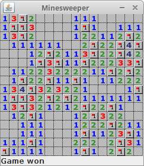

# Java Minesweeper

## Description

This is a Java implementation of the classic Minesweeper game. It provides a simple and intuitive interface for playing the game, along with customizable difficulty levels.

## Features

- Classic Minesweeper gameplay with left-click to reveal tiles and right-click to flag mines.
- Adjustable grid size and mine density for varying difficulty levels.
- Timer to track your progress.
- Win and lose conditions with appropriate messages.
- Sound effects to enhance the gaming experience.
- High scores leaderboard to keep track of your best performances.

## How to Play

1. Clone the repository or download the source code.
2. Compile the Java files using your preferred Java compiler.
3. Run the Board.java file to start the game.
4. Use left-click to reveal tiles and right-click to flag potential mines.
5. Win the game by uncovering all non-mine tiles or lose by revealing a mine